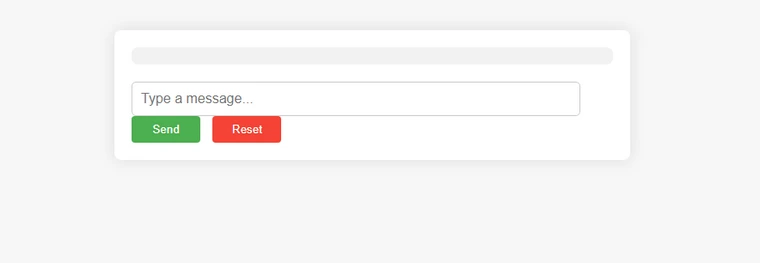
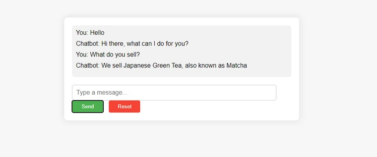

# AI Chatbot

This is a simple chatbot developed to be a customer support assistant for an online matcha storefront. It is trained using a Feedforward Neural Network using the PyTorch library.




## Usage

Install the dependencies

```bash
pip install pytorch
pip install nltk
pip install flask
```

Run server

```bash
python app.py
```

Visit `http://localhost:5000` in your browser.
